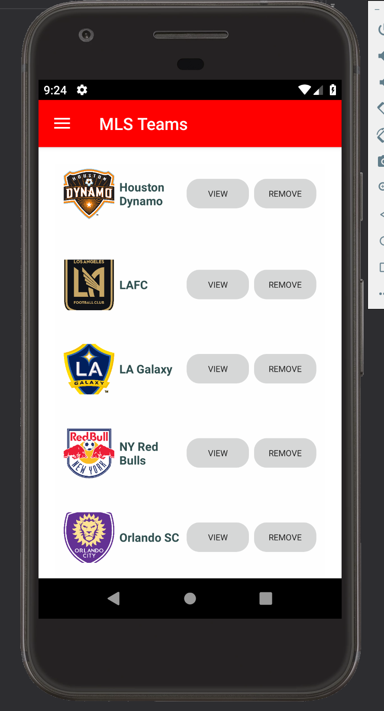
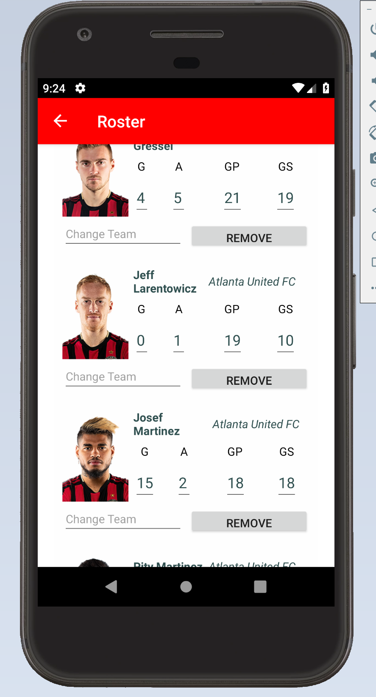
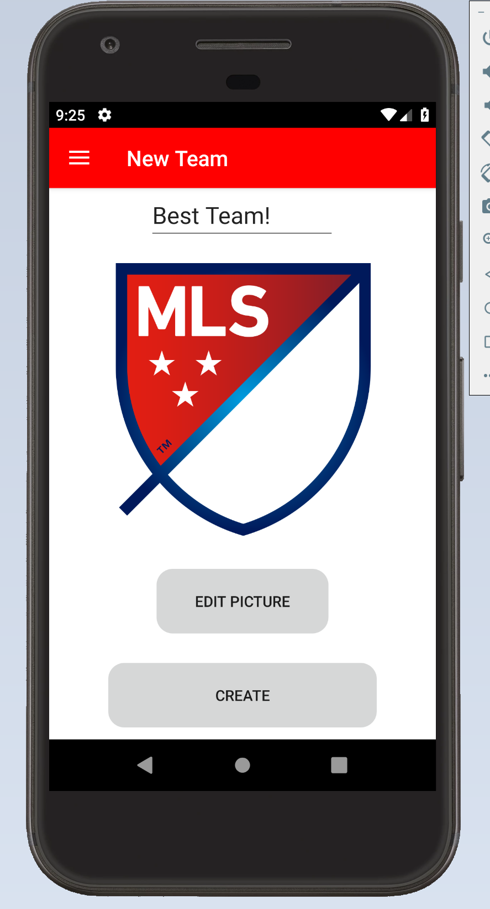
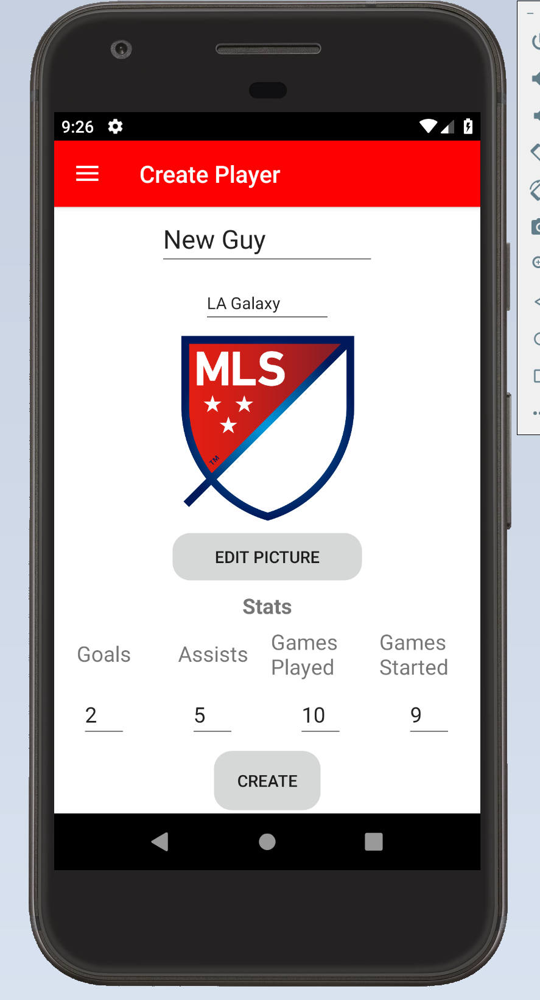

## FandomTechTest

FTT was built with VS2019 Community using Xamarin/C#/.Net for Android 9.0. The step by step guide assumes the reader is starting from the beginning.

### Configuring FTT (Fandom Technical Test) build environment

1. Install Visual Studio 2019 Community Edition from Microsoft. 
2. Once downloaded, configure VS2019 by selecting ".Net desktop environment" within the installer. Be sure to check additional options targeting ANdroid mobile platforms such as the latest "Android SDK setup" (should be API level 27). 
3. Complete installation of Visual Studio 2019.'

### Building FTT

1. Launch VS2019 and select clone or checkout repository.
2. Use the clone link from GitHub to download this repo to a local directory.
3. Open the FTT.sln file that should be visible within the VS solution explorer.
4. Once the solution loads, hit Ctrl+Shift+B. The solution should build successfully.

### Running FTT

1. To run and test FTT an Android phone or emulator is required. THe walkthrough assumes the reader will use the built in Android Device Manager tools for VS or a previously configured Android phone with debugging enabled.
2. (Optional) Configure an Android virtrual device in the Device Manager. FTT was primarily devloped on the pixel template but tested on others as well.
2. If the solution has been built, hit Ctrl+F5 to launch the app without debugging features. Wait for it to load.

### Basic User Test FTT

1. Once the app loads you should see a list of MLS teams. Their names and logos are displayed as well as a couple of button options. THere is also a side bar menu that allows navigation to the "Create Team" and "Create Player" pages.
2. Explore and test the app by using the various features:
    - View Team - Displays all players on the team and shows their detailed statistics. 
    - Remove Team - The team is removed from the league. The team and all of its players are no longer visible. 
    - Edit player stats - From the team sub page, the players stats can be edited by touching a value and entering a new one.
    - Change player team - The change team button allows the user to select a new team for the player. That player is instantly moved to the new team.
    - Remove player - The player is removed from the team and sent to Free Agents. If the player is removed from Free Agents, they are removed from the leauge.
    - Custom Team - The user can create a custom team from the "Create Team" page by entering a name and selecting a logo. The logo must be a image url such as one extracted in Chrome via the "copy image address" option. Otherwise, no imnage will be shown. 
    - Create Player - A custom player can be made by filling out all of the options on the "Create Player" page. The user may enter a name, picture (same as logo), and stats. A team must be selected as well.
    
Sample Test Case:

All of the app's features can be used in combination with one another. For example, a likely scenario would be the creation of an MLS draft team. A new team is being added to MLS and has the oppurtunity to pick from existing rosters.
1. Create a new team.
2. Create a handful of new players and add them to the new team.
3. Move several players from other teams to Free Agents and then move them to the new team. Pick a single player from each of the other teams, if desired and add them to the new team.
4. Done

### Screenshots
    

